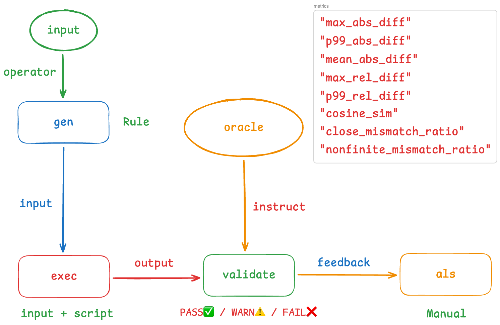

# FUEL-JAX

面向 JAX / PyTorch 的算子差分测试小框架。当前主要覆盖 `dataset/jax_rules.yaml` 里的一元 / 二元算子输入生成与执行对比。



## 1. 快速开始

### 1) 安装依赖（推荐使用 uv）

```bash
uv sync
```

### 2) 生成输入

> `gen` 子命令需要 **完整 JAX 名称**（如 `jax.lax.pow`）。

```bash
# 单个算子
.venv/bin/python -m fuel_jax.main gen --op-name jax.lax.pow --shape 2,3 --seed 0

# 生成全部规则中的算子
.venv/bin/python -m fuel_jax.main gen --op-name all --seed 0
```

默认输出到：
- 单个算子：`input/<op_name>/00.npz`
- 全部算子：`input/<op_name>/00.npz`

### 3) 执行对比

> `exec` 使用 **完整 JAX 名称**（如 `jax.lax.abs`）。

```bash
# 运行单个算子
.venv/bin/python -m fuel_jax.main exec --op-name jax.lax.abs --device gpu --mode compiler --test-id 0

# 执行全部
.venv/bin/python -m fuel_jax.main exec --op-name all --device gpu --mode compiler --test-id 0
```

输出路径默认：
```
output/<op_name>/<precision>/jax_<device>.npz
output/<op_name>/<precision>/torch_<device>.npz
```

### 4) 验证结果

```bash
.venv/bin/python -m fuel_jax.main validate --op-name jax.lax.abs
.venv/bin/python -m fuel_jax.main validate --op-name all
```

## 2. 规则文件（输入生成）

`dataset/jax_rules.yaml` 定义输入生成策略。主要结构：

- `definitions.strategies`：策略模板（uniform / normal / int）
- `unary_operators` / `binary_operators`：每个算子的输入与生成策略

示例（标准正态 + 限制域）：

```yaml
- op_name: jax.lax.log
  input: [x]
  generation: {x: *strat_pos}   # 正数

- op_name: jax.lax.integer_pow
  input: [x, y]
  generation:
    x: *strat_normal
    y: *strat_int_scalar         # 标量整数
```

支持的 strategy：
- `uniform`：`range: [low, high]`
- `normal`：`mean`, `std`
- `int`：`range: [low, high]`（标量整数）
