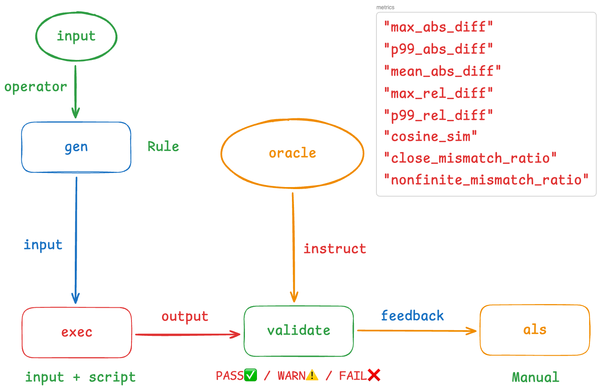

# FUEL-JAX

面向 JAX / PyTorch 的底层算子差分测试框架（输入生成 -> 多框架、设备执行 -> 差分验证）。



## TODO
- [ ] 完善 Oracle 规则
- [ ] 完善 矩阵乘法的 shape 生成策略
- [ ] 实现 Mutate 策略
- [ ] 深入算子底层，详细剖析不一致原因，寻求合理解释

## 功能概览

- 基于 `dataset/jax_rules.yaml` 自动生成算子输入（`.npz`）。
- 按映射表执行 JAX / Torch 对应算子（支持 `cpu/gpu/tpu` 模式）。
- 基于多指标 oracle 输出 `PASS/WARN/FAIL`，并写入日志。
- 支持 `gen/exec/validate` 分步执行，也支持 `run` 一键执行。

## 环境要求

- Python `>=3.12`（见 `pyproject.toml`）
- 推荐使用 `uv`：

```bash
uv sync --extra cpu # (cuda tpu)
```

## 快速开始

> 所有命令中的 `--op-name` 都使用完整 JAX 名称，例如 `jax.lax.sin`。

### 1) 生成输入（gen）

```bash
# 单个算子，默认写入 input/<op>/00.npz
.venv/bin/python -m fuel_jax.main gen --op-name jax.lax.sin --shape 2,3 --seed 0 --test-id 0

# 生成 rules.yaml 中全部算子
.venv/bin/python -m fuel_jax.main gen --op-name all --seed 0 --test-id 0
```

参数说明：
- `--shape`：如 `64,64`，或 `scalar`
- `--test-id`：决定输入文件名 `00.npz / 01.npz / ...`

### 2) 执行（exec）

```bash
# 单个算子
.venv/bin/python -m fuel_jax.main exec --op-name jax.lax.sin --device gpu --mode compiler --test-id 0

# 执行全部（会扫描 input 下存在 test_id 文件的算子）
.venv/bin/python -m fuel_jax.main exec --op-name all --device gpu --mode compiler --test-id 0
```

行为说明：
- `device=cpu/gpu`：执行 JAX + Torch，并只跑双方都支持的精度（依据 `dataset/jax2torch_map.csv` 的精度列）。
- `device=tpu`：仅执行 JAX。
- `mode=eager|compiler`：分别对应非编译/编译模式。

### 3) 验证（validate）

```bash
.venv/bin/python -m fuel_jax.main validate --op-name jax.lax.sin
.venv/bin/python -m fuel_jax.main validate --op-name all
```

验证会对同一算子、同一精度目录下的输出做两两比较，输出 `PASS/WARN/FAIL`。

### 4) 一键执行（run）

```bash
.venv/bin/python -m fuel_jax.main run --op-name jax.lax.sin --device gpu --mode compiler --test-id 0
```

`run` 等价于按顺序调用：`gen -> exec -> validate`。

## 目录结构

```text
🏠 FUEL-JAX/
├── 📂 assets/                       # 文档配图与静态素材
├── 📂 dataset/                      # 规则与映射数据
│   ├── 🧾 jax_rules.yaml            # 输入生成规则（按算子类型：elementwise/reduction/linalg/array/other）
│   ├── 🧾 jax2torch_map.csv         # JAX->Torch 映射主表（含精度兼容信息）
│   └── 🧾 jax2torch_todo.csv        # 待补齐映射/暂不支持算子清单
├── 📂 experiment/                   # Notebook、临时实验脚本与配置
├── 📂 fuel_jax/                     # 框架核心实现
│   ├── 📂 config/
│   │   └── 🧾 config.py             # 全局常量：精度映射、阈值、日志路径
│   ├── 📂 difftesting/
│   │   ├── 🧾 exec.py               # 执行器：拉起 JAX/Torch 子进程并记录执行日志
│   │   ├── 🧾 oracle.py             # 指标计算与 PASS/WARN/FAIL 裁决
│   │   └── 🧾 validate.py           # 结果聚合与两两差分验证
│   ├── 📂 generator/
│   │   ├── 🧾 generate.py           # 输入生成核心（按 jax_rules.yaml 产出 npz）
│   │   └── 🧾 mutate.py             # 输入扰动/变异策略(TODO @haifeng)
│   ├── 📂 script/
│   │   ├── 🧾 jax_script.py         # JAX 侧单算子执行入口（含 jit/static 参数处理）
│   │   └── 🧾 torch_script.py       # Torch 侧单算子执行入口（含映射适配）
│   ├── 📂 utils/
│   │   └── 🧾 utils.py              # 通用工具：IO、映射读取、类型转换、shape 解析
│   └── 🧾 main.py                   # CLI 总入口：gen / exec / validate / run
├── 📂 input/                        # gen 产出的输入样本（按算子分目录）
├── 📂 op_test/                      # 单算子复现与实验脚本
├── 📂 output/                       # exec 产出的输出结果（按算子/精度/设备组织）
├── 🧾 README.md                     # 项目文档与使用说明
├── 🧾 pyproject.toml                # 依赖与项目配置
├── 🧾 EXEC.log                      # 执行阶段日志
└── 🧾 VALIDATE.log                  # 验证阶段日志
```

## 规则文件说明（dataset/jax_rules.yaml）

当前按算子类型组织：
- `elementwise`
- `reduction`
- `linalg`
- `array`
- `other`

常见生成策略：
- `uniform`：均匀分布，`range: [low, high]`
- `normal`：正态分布，`mean/std`
- `int` / `float`：标量
- `axis`：根据输入张量维度自动生成合法轴
- `axes_tuple`：生成多轴 tuple（用于 `reduce_*`）
- `square_normal`：生成 `N x N` 标准正态矩阵，常用于需要方阵输入的线代算子。
- `symmetric_matrix`：先采样方阵 `X`，再构造 `(X + X^T) / 2`，保证输出为实对称矩阵（如 `eigh`）。
- `spd_matrix`：先采样方阵 `X`，再构造 `X @ X^T + eps * I`，保证对称正定（如 `cholesky`）。
- `triangular_matrix`：先采样方阵 `X`，再取 `triu(X)` 或 `tril(X)`，生成上/下三角矩阵（如 `triangular_solve`）。

示例：

```yaml
- op_name: jax.lax.cumsum
  input: [operand, axis]
  generation:
    operand: *strat_normal
    axis:
      strategy: axis
      from_input: operand

- op_name: jax.lax.reduce_sum
  input: [operand, axes]
  generation:
    operand: *strat_normal
    axes:
      strategy: axes_tuple
      min_len: 1
      sorted: true
```

## 差分指标

验证核心指标包括：
- `max_abs_diff / p99_abs_diff / mean_abs_diff`
- `max_ulp_diff / p99_ulp_diff / mean_ulp_diff`
- `max_rel_diff / p99_rel_diff`
- `cosine_sim`
- `close_mismatch_ratio`
- `nonfinite_mismatch_ratio`

阈值配置见 `fuel_jax/config/config.py` 中的 `DIFF_ORACLE_THRESHOLDS`。

## 常见问题

- `TracerIntegerConversionError / ConcretizationTypeError`：
  这类算子参数（如 `axis/axes/k/index_dtype/dimension_numbers`）需要作为静态参数；当前脚本已对常见算子做了处理。
- `Not enough outputs to compare`：
  该精度目录中输出文件不足 2 个，无法两两比较。
- `--device gpu` 但机器无可用后端：
  会自动回退到 `cpu`（JAX/Torch 各自处理）。
